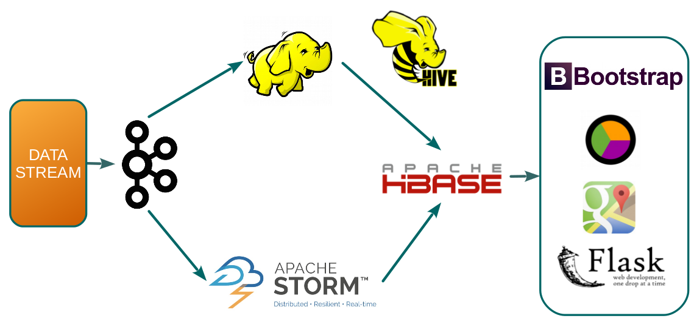
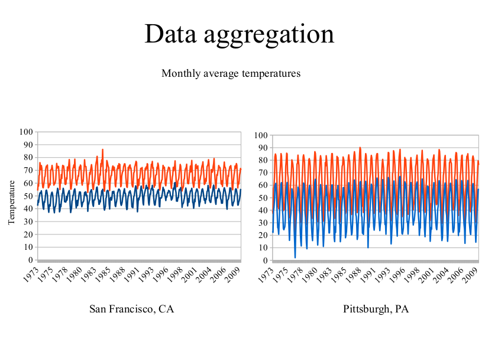
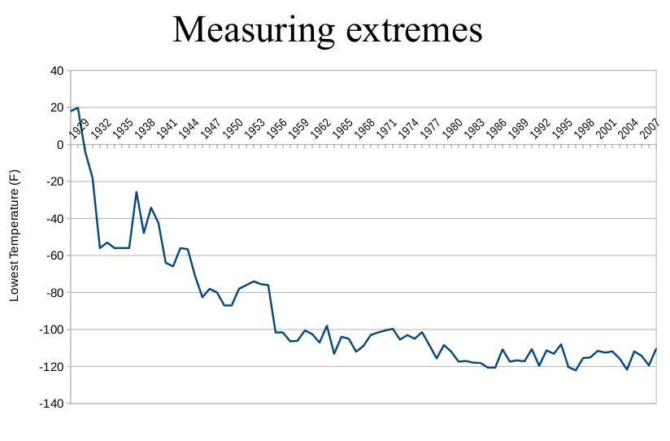

Real Time Weather Anomaly Detector
==================================
## A data pipeline to monitor global weather anomalies in real-time using the NOAA sensor network

*The documentation of the project is a continuing process*

Table of Contents:

1. Motivation
2. Data Pipeline
3. Operation 
4. Install
5. Schema and code samples

## 1. Motivation

The National Oceanic Atmospheric Agency [(NOAA)](http://www.noaa.gov/) tracks global weather using a network of about 12000 - 15000 sensors distributed globally. Global weather is one of the most dynamic systems in existance on the planet. The effect of disruptions caused by weather anomalies have far reaching consequences on all aspects human civilization. The impact of weather disruptions can be felt on global economy, food production, loss of life and global transport network etc.

The motivation behind developing the proof-of-concept pipeline can be summerized as follows:

1. The project aims to provide a solution to track the location and occurances extreme weather events or anomalies in real-time. These  capabilities can be extremely useful for generating rapid response to the damage caused by weather anomalies. 

2. Provide a unified platform to integrate real-time data streams coming from a very large number of monitoring stations to simplify monitoring of weather anomalies.

3. Provide a way to incorporate incoming real-time data streams into the historical weather data. This solution can be can be very useful for data scientists and climatologists to test climate models. The ease of querying such a large and rich data set can result in shorter testing times for a particular model and ability to iterate faster through the candidate models.

4. In light of increasing weather disturbances caused by global climate change, the project aims to provide  the local governments with an API which can be used to asses and project the impact of weather anomalies. 

## 2. Data Pipeline

The data pipeline employed utilizes [Lambda Architecture](https://en.wikipedia.org/wiki/Lambda_architecture). The advantages of lambda architecture for large distributed, faults tolerant systems are well documented. The entire architecture is deployed in Amazon cloud services.

## 3. Data Download and Ingestion

The data is downloaded from a public dataset hosted on a [Amazon S3 bucket](https://aws.amazon.com/datasets/2759).

Once the data is downloaded, it is stored locally on one of the cluster nodes. In absence of access to current real-time streaming data, the historical data is replayed as a real-time stream. [Apache Kafka](https://kafka.apache.org/) is used as a message queuing system. Kafka is a distributed, robust and fault tolerant while at the same time being able to handle a very large volume of incoming messages. Kafka routes two different copies of the incoming stream into the batch layer and speed layer (real-time computation).

## 4. Batch Layer

One of the kafka consumer uploads all the incoming data into a HDFS cluster. The HDFS cluster serves as the source of truth and permanent storage. Batch processing of data is accomplished using [Apache Hive](https://hive.apache.org/). Hive provides a SQL-like interface for launching map reduce jobs for querying the entire dataset. The views generated from querying the entire data set are forwarded to the serving layer. The images below give two examples of the sort of data aggregation possible using Hive.

See the [inall directions](INSTALL.md) for installation instructnions

## 4. Schema and Code Sample

See the [schema descriptions and code samples](SCHEMA.md) for description on the schemas and example code snippets.
