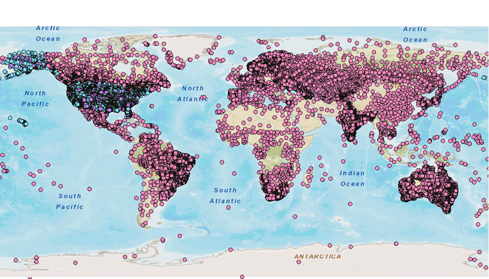

# Real Time Weather Anomaly Detector
============

*The documentation of the project is a continuing process*

Table of Contents:

1. [Introduction](README.md#1-introduction)
2. [REST API](README.md#2-rest-api)
3. [Operation](README.md#3-operation) 
4. [Install](README.md#4-instal)
5. [Schema and code samples](README.md#5-schema-and-code-sample)

## 1. Introduction

The project aims to build a real-time weather anomaly detector using streaming data from NOAA weather sensor network. 

## 2. Operation

## 3. Install

See the [install directions](INSTALL.md) for installation instructions

## 4. Schema and Code Sample

See the [schema descriptions and code samples](SCHEMA.md) for description on the schemas and example code snippets.
